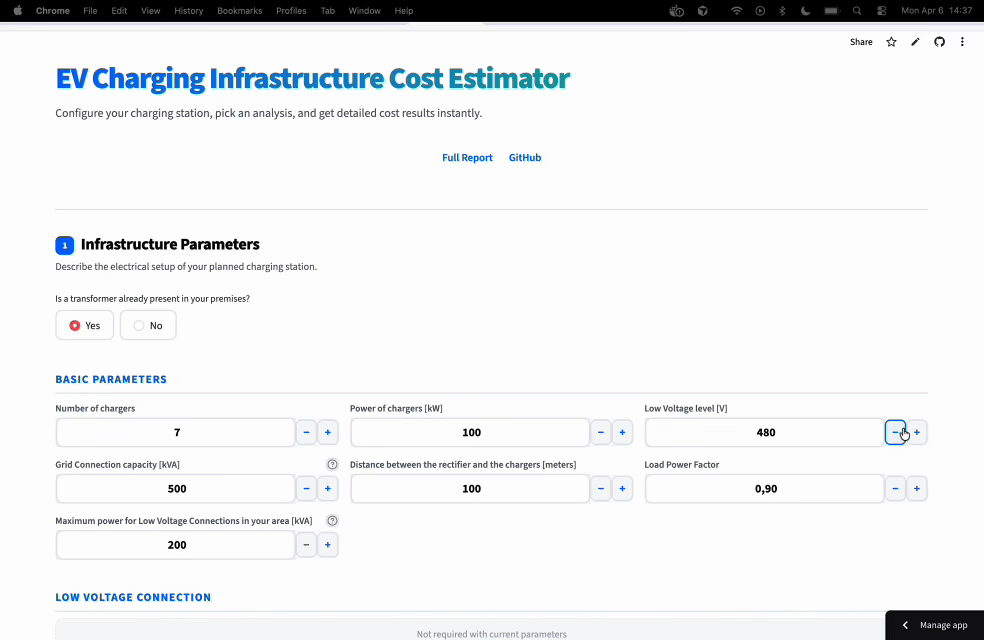

# EV Charging Infrastructure Cost Estimator

A Streamlit web app for estimating investment costs of EV charging stations. Based on the master's thesis research conducted at KTH Royal Institute of Technology in collaboration with Scania AB.

## Demo

<!-- Replace the path below with your actual GIF -->


## Features

- **Cost Breakdown** — Itemized cost estimate for chargers, cables, transformers, switchgear, installation, site preparation, and more
- **Sensitivity Analysis** — Vary one parameter at a time to see which inputs drive costs the most
- **Two-Parameter Sensitivity** — Vary two parameters simultaneously with an interactive scatter plot
- **PDF Report Export** — Generate a full report with inputs, tables, charts, and a methodology reference
- **Excel Export** — Download individual tables as `.xlsx` files

## Getting Started

```bash
git clone https://github.com/davide-ferraro/ev-charging-cost-estimator.git
cd ev-charging-cost-estimator
python -m venv venv
source venv/bin/activate
pip install -r requirements.txt
streamlit run app.py
```

## Live App

Deployed on Streamlit Community Cloud — [Open the app](https://ev-charging-cost-estimator.streamlit.app)

## Full Report

The methodology behind the cost models is documented in the original thesis:
[Read the full report on DiVA Portal](https://www.diva-portal.org/smash/record.jsf?dswid=1523&pid=diva2%3A2007635&c=5&searchType=SIMPLE&language=en&query=investment+cost+charging+infrastructure+heavy+duty&af=%5B%5D&aq=%5B%5B%5D%5D&aq2=%5B%5B%5D%5D&aqe=%5B%5D&noOfRows=50&sortOrder=author_sort_asc&sortOrder2=title_sort_asc&onlyFullText=true&sf=all)
